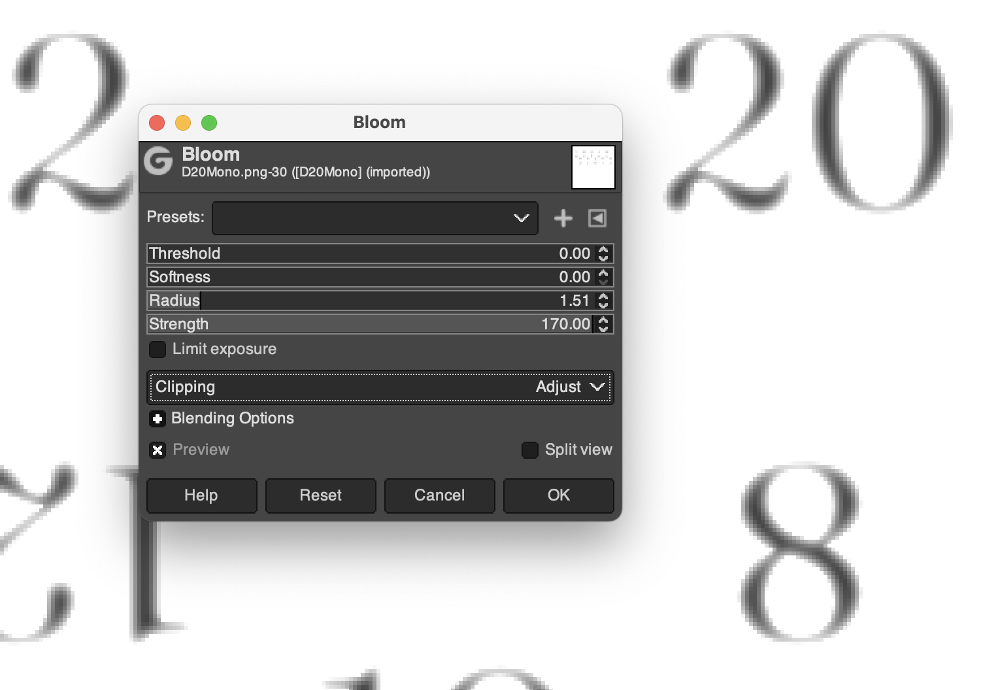

# Dice

Determistic 3D dice rolling library for React.

## Local development

Check out, `npm install`, `npm run build`, then `npm link` to make the package available locally. To import to another project, run `npm link @trepidacious/dice` in that project, this will add the local build `dice`, it can be imported normally.

After changing `dice` code, run `npm run build` again, changes should be available in any linked projects immediately.

## Expanding the ESLint configuration

If you are developing a production application, we recommend updating the configuration to enable type aware lint rules:

- Configure the top-level `parserOptions` property like this:

```js
export default {
  // other rules...
  parserOptions: {
    ecmaVersion: 'latest',
    sourceType: 'module',
    project: ['./tsconfig.json', './tsconfig.node.json'],
    tsconfigRootDir: __dirname,
  },
}
```

- Replace `plugin:@typescript-eslint/recommended` to `plugin:@typescript-eslint/recommended-type-checked` or `plugin:@typescript-eslint/strict-type-checked`
- Optionally add `plugin:@typescript-eslint/stylistic-type-checked`
- Install [eslint-plugin-react](https://github.com/jsx-eslint/eslint-plugin-react) and add `plugin:react/recommended` & `plugin:react/jsx-runtime` to the `extends` list

## Notes on Dice models

Engraved text is produced from a height map. Take the mono (black text on white background), and use the `Bloom` filter, with Threshold and Softness set to 0, radius set based on the size of the text so that the bloom effect covers most of the "width" of the strokes of the letters, and strength to 170. You should see that the letters are nearly white at the edges, and still mostly black at the centers of the strokes, with a smooth transition between. This is what gives the 3d engraved effect when the image is used as a height map.



To use models, first export from blender (settings should be saved - make sure to select the die you want and check "export selected" is enabled). This exports to the `blender` dir, files here are in `.gitignore`. Leave the export name as `dice.glb`. Now convert with `gltfjsx`:

```bash
cd blender
npx gltfjsx dice.glb --transform --types
```

This should produce two files, `Dice.tsx` and `dice-transformed.glb`. You now need to do some renaming and moving - here we are working on the `D6` model, replace this with the actual dice name.

The `Dice.tsx` file will have types for the `GLTFResult` loaded from the `glb` file, however to use the model as a die we need to set scale, rotation, shadows etc. Therefore the easiest approach is to just copy an existing die's component, e.g. from `/lib/models/D6.tsx`, and then search and replace `D6` with the actual die name. This should update the component name, the names of the mesh and materials node, the props name, and the `.glb` resource name. If the die uses different/additional meshes/materials, then you may need to use the types from the generated `Dice.tsx` file to update the contents, or just start from that and introduce the forward ref, `scale` and `meshQuaternion` props.

Now move the transformed GLB to the public folder with the correct dice name, and delete the original glb:

```bash
mv dice-transformed.glb ../public/D6.glb
rm dice.glb
```
