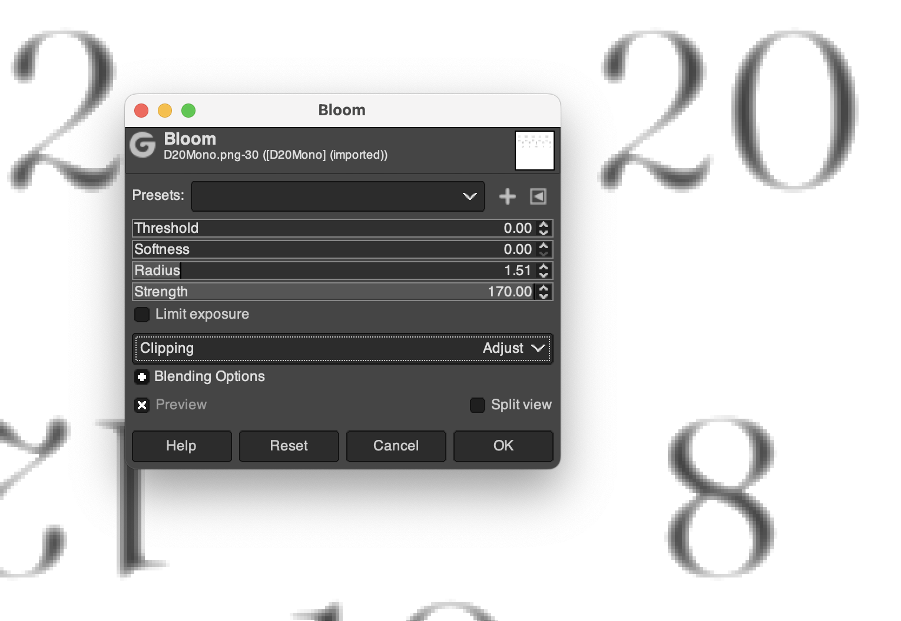

# Dice

Deterministic 3D dice rolling library for React.

Versions:

- `v1` releases work with react 18.
- `v2` releases work with react 19.

## Local Development

To just run directly, `npm install` and then `npm run dev`.

To set up a link to allow live development of `dice` as used by another local project, run `npm install`, `npm run build`, then `npm link` to make the package available locally. To import to another project, run `npm link @trepidacious/dice` in that project, this will add the local build `dice`, it can be imported normally.

After changing `dice` code, run `npm run build` again, changes should be available in any linked projects immediately.

Note that this was originally created with `npm create vite@latest` using React and TypeScript options. Configuration files can be updated based on this - most recently this was done with `Oxlint` selected as the linter.

## Linting

Run `npm run lint` for `oxlint`, you can also run `tsc` for actual TypeScript errors.

## Storybook

A simple storybook setup is provided to allow testing different dice settings, try `npm run storybook`.

## Notes on Dice Models

Engraved text is produced from a height map.

Take the mono (black text on white background), and use the `Bloom` filter, with:

- Threshold and Softness set to 0
- Radius set based on the size of the text so that the bloom covers most of the "width" of the strokes of the letters
- Strength to 170.

You should see that the letters are nearly white at the edges, and still mostly black at the centers of the strokes, with a smooth transition between. This is what gives the 3d engraved appearance when the image is used as a height map.



To use models, first export from blender (settings should be saved - make sure to select the die you want and check "export selected" is enabled). This exports to the `blender` directory, files here are in `.gitignore`. Leave the export name as `dice.glb`. Now install `gltf-transform` with `npm install --global @gltf-transform/cli`, then use to optimise textures:

```bash
cd blender
gltf-transform webp dice.glb ../public/D6.glb
```

To use the model as a component, copy an existing die's component, e.g. from `/lib/models/D6.tsx`, and then search and replace `D6` with the actual die name. This should update the component name, the names of the mesh and materials node, the props name, and the `.glb` resource name. If the die uses different/additional meshes/materials, then you may need to update the types etc. See the `gltfjsx` project for examples - run with `--types` to generate a `.tsx` file you can use as a base. Note that you can also transform the `glb` files with `gltfjsx`, however in practice this sometimes seems to break the model's shading.

## Coordinsanity

Every piece of 3D software has to use a different coordinate system, according to ancient custom. When converting from Blender coordinates to `Three.js`, the mapping is as follows, tested by exporting a vertex at (1, 2, 3) to `GLB` then inspecting data:

- Blender: `(x: 1, y: 2, z: 3)`
- `Three.js`: `(x: 1, y: 3, z: -2)`

To convert from Blender to `Three.js`, we swap the y and z values, then make the z value negative. This is handy when e.g. trying to get face corner vertex coordinates, where it's easier to select them in blender and read off coordinates than to try to work out which vertex in an exported `.glb` file is which.

## Known Issues

You may see the following warnings in the console - these should be fixed when `react-three-fiber` `v10` is released:

1. `THREE.Clock: This module has been deprecated. Please use THREE.Timer instead.`
2. `THREE.WebGLShadowMap: PCFSoftShadowMap has been deprecated. Using PCFShadowMap instead.`
